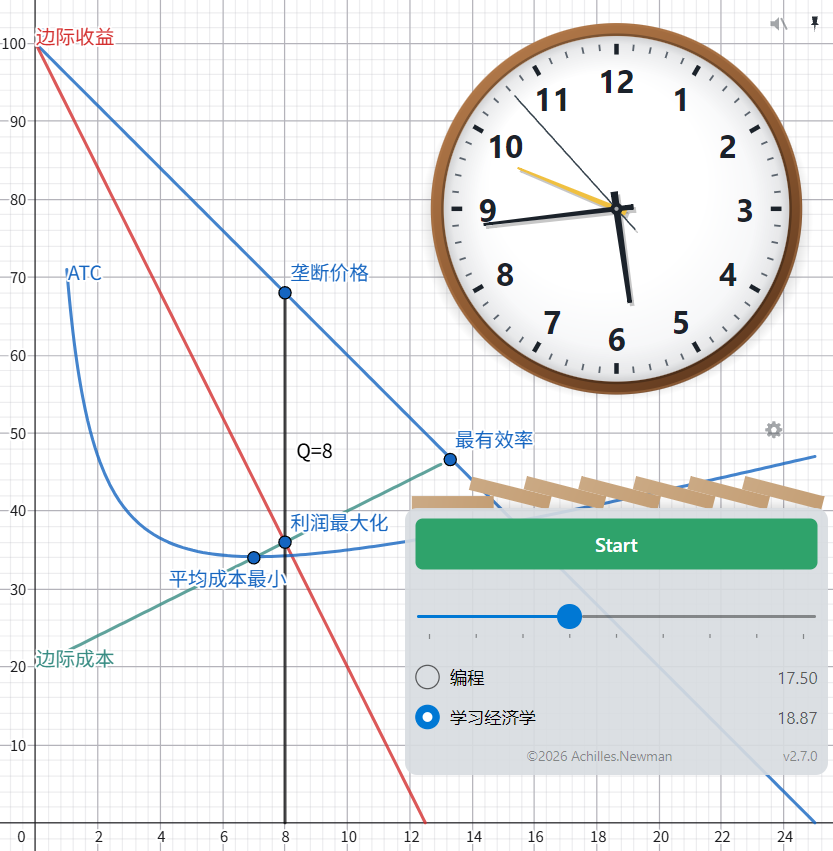
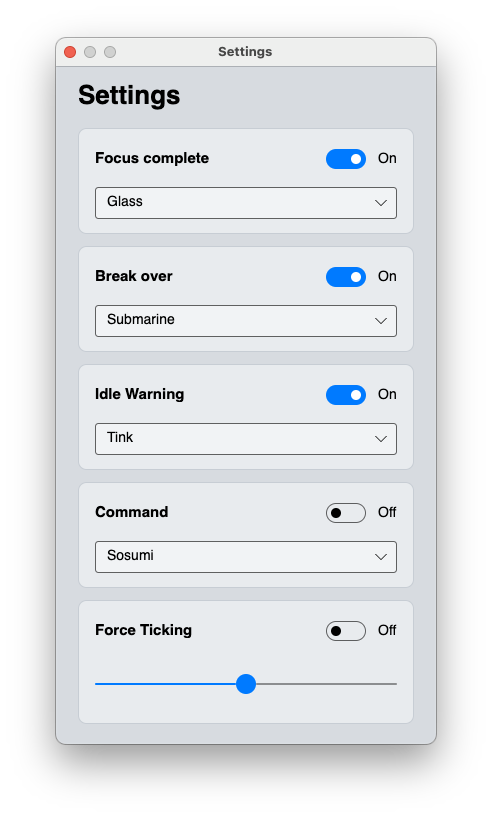

# ItamiTimer

A desktop focus timer with **enforced constraints**, for Windows and macOS.

Classic pomodoro apps trust you to stay on task; ItamiTimer doesn't. It reads your actual
window activity from [ActivityWatch](https://activitywatch.net/) and only counts the minutes
you *provably* spent inside the goal you committed to — with you actually at the keyboard.
Wander off to a browser, a chat app, or away from the desk, and those minutes silently don't
count: the grey deadline arc on the clock face slides further away, and you watch it go.




**All the pain comes from the dial**
```
痛みを感じろ，
痛みを考えろ，
痛みを受け取れ，
痛みを知れ，
痛みを知らぬ者（もの）に，
本当の平和はわからん，
俺は弥彦（やひこ）の痛みを忘れない，
ここより，
世界に痛みを，
神罗天征（しんらてんせい）。
```

## The pomodoro technique, and how this differs

The classic technique (Cirillo, 1980s): pick a task, set a 25-minute timer, work until it
rings, take a 5-minute break; every four rounds take a longer break. Its two known weak
points are that the timer measures *elapsed* time, not *focused* time, and that compliance
is entirely on the honor system.

ItamiTimer keeps the frame — one commitment, one focus block, one earned break — and
replaces the honor system with an audit:

| | Classic pomodoro | ItamiTimer |
|---|---|---|
| What counts | Wall-clock time | Only seconds matching your chosen goal, while present |
| Timer state | A countdown in memory | **No countdown exists.** The dial is a projection of ActivityWatch history |
| Slacking | Timer keeps running | Seconds don't count; the deadline arc slides forward — the task takes longer |
| Being away (AFK) | Timer keeps running | Doesn't count, and isn't blamed — drawn as a hollow dashed box, not red |
| Punishment | None | Time itself. Nothing is voided, nothing beeps; you just finish later |
| Break | Fixed 5 min | ⌈focus ÷ 5⌉ min, starting the moment completion is detected |
| Long break every 4 rounds | Yes | No — one task = one focus + one rest, then the program **stops and waits** |
| Auto-start next round | Common | **Never.** Starting a task is always your act |
| Report | Varies | None on screen, ever. The dial's coloured cells are the whole story |

## Window

Since 2.0.0 the window has **no frame and no background** — no title bar, no border, no
grey backdrop. The clock sits directly on your wallpaper; only the controls below the Start
button keep a light card behind them so the slider and goal list stay readable.

Losing the title bar changes two everyday things:

- **Move it by dragging the clock face.** Anywhere on the dial works; the controls below it
  behave normally. (The draggable region follows what is actually painted, so the corners
  of the dial's bounding box are not part of it.)
- **Close it from the clock face's right-click menu** (or the taskbar / Dock as before).
  Closing mid-focus still asks first — quitting abandons the round, as it always has.

Four icons sit in the window's top-right corner, in a 2x2: ticking, always-on-top, settings,
and — since 3.0.0 — **light / dark theme**. The theme icon shows where you are rather than
where a click would take you: a sun by day, a bitten cookie of a moon by night. One click
repaints everything at once, the dial and dominoes included, and the choice is remembered.
There is no "follow the system" option; the two states are the whole set.

Since 3.3.0 **the clock face blinks while you are off task** — every second it flips to the
opposite theme and back, dark, light, dark, light, until you return. Only the face, the ticks
and the hands take part; the wooden bezel, the coloured ring, the card and every other window
stay exactly as you set them. This is a signal, not a theme change, and like everything else
here it is silent — nothing pops up, nothing beeps. A steadily inverted dial becomes wallpaper
within a minute; a blinking one does not, which is the entire point. (It alternates once a
second — a 0.5 Hz flash, far below the threshold associated with photosensitive seizures.)

One thing worth knowing: ActivityWatch reveals a window switch a few seconds after it
happens, so expect three to ten seconds of delay in each direction. And when ActivityWatch
is down the face simply stays the way you set it — those minutes are counted as focus
anyway, and a signal that contradicts the ledger would be worse than no signal.

The window remembers where you left it. If a position ends up off-screen — you dragged it
past an edge, or the monitor it was on is gone — it returns to the visible area on its own
once you let go. Dragging *between* monitors is unaffected: it settles onto whichever
screen it mostly landed on.

## Requirements

- **[ActivityWatch](https://activitywatch.net/) running locally**, with **both** watchers:
  `aw-watcher-window` (what's focused) and `aw-watcher-afk` (are you there). The afk watcher
  is not optional — window events keep growing via heartbeats even when nobody is at the desk,
  so without afk data "walk away with the right window focused" would be invisible free time.
- .NET 10 runtime (SDK to build).

## Build & run

```bash
dotnet build ItamiTimer.slnx
dotnet test ItamiTimer.slnx
```

Publish for Windows (RID required — without it the output balloons to ~560 MB of
every platform's native Skia/HarfBuzz binaries):

```bash
dotnet publish src/ItamiTimer.App -c Release -r win-x64 --self-contained false -o "$LOCALAPPDATA/Programs/ItamiTimer"
```

Result: ~27 MB / 35 files. Publishing strips the two giant native `.pdb` files
automatically (an MSBuild target in the csproj — `dotnet publish` alone does not).

macOS — must be packed as a `.app` bundle (icon, Dock, and the `DOTNET_ROOT`
environment for Finder-launched apps):

```bash
./pack-macos.sh --dmg
```

Windows — for handing to other people rather than a local dev build, pack an installer
(`dist/ItamiTimer-<version>-win-x64.exe`). It checks for the .NET Desktop Runtime at
install time and offers to download + install it if missing, so the target machine
doesn't need .NET preinstalled. Requires Inno Setup 6 (`winget install --id
JRSoftware.InnoSetup -e`) as a build-time tool:

```powershell
.\pack-windows.ps1
```

The focus-length slider is **10–50 minutes in Release** and **3–10 minutes in Debug**, so a
development build doesn't make you sit through 25 real minutes to see the completion moment.

## Project layout

```
src/ItamiTimer.Core/    net10.0  the accounting engine: rules, judgment buffer, projections.
                                 No UI, no platform calls — enforced by the csproj.
src/ItamiTimer.Cli/     net10.0  `itami` — dry-run the engine, and pick/test the alarm command.
                                 The only place that ever prints a report.
src/ItamiTimer.App/     net10.0  Avalonia UI: dial, dominoes, sounds, alarm, alarms list, settings.
tests/                  xUnit    pure-function tests: synthetic events, no waiting.
```

Everything the program draws — dial, dominoes, window-chrome icons, the exe icon itself — is
computed vector geometry. The repository contains no bitmap or audio assets; even the
tick-tock is synthesized at runtime (white noise burst + damped sine), and notification
sounds come from whatever the OS already ships.

Runtime data:

| | |
|---|---|
| Windows | `%LOCALAPPDATA%\ItamiTimer\` |
| macOS | `~/Library/Application Support/ItamiTimer/` |

| File | Written by | Contents |
|---|---|---|
| `rules.json` | **you**, by hand | your goals, and optionally `executeCommand` |
| `settings.json` | the program | sound choices, switches, the alarm time, the window position |
| `during.json` | the program | accumulated focus seconds per goal, and how far that count has been carried |
| `alarms.md` | **you** (or a script), by hand | scheduled reminders — see below |
| `itami.log` | the program | 1 MB rolling; the UI is silent, so this is the only place to find out what happened |

Task state is **never** written to disk. Closing the program abandons the current round.

### Where the accumulated hours come from

The number beside each goal is **not** a tally the program keeps as it runs. It is
re-derived from ActivityWatch's own history, and `during.json` only ever stores a
checkpoint: how many seconds so far, and the moment that count reaches.

Every time you start a task, the program replays `[last counted moment, this task's start)`
against your rules for that goal, adds what it finds, and moves the checkpoint forward.
That span covers your **previous** round plus **all the time in between** — so time you
spent on the goal without a timer running still counts. During a round the displayed
number follows along live, but nothing is written until the next start.

Two consequences worth knowing:

- **Nothing is ever lost to a crash.** ActivityWatch is the source of truth; the next
  start re-derives whatever the checkpoint hasn't covered yet.
- **The first time you start a given goal, it counts your whole history** — which can take
  a moment, and makes the number jump once. After that each backfill is small.

### Scheduled reminders (Alarms list)

Separate from the one-shot alarm hand on the dial, ItamiTimer can also watch a plain
Markdown checklist for standing appointments — medication, a check-in time you set in your
own notes or calendar, anything with a fixed moment attached. Point a script (or your own
hand) at `alarms.md` in the data directory above:

```markdown
- [ ] 2026-08-06 14:00 Take medication
- [ ] 2026-08-06 21:30 Evening check-in
- [x] 2026-08-05 09:00 Already done — check it off to mute a single entry
```

The program only ever reads this file — it never writes back, never deletes a past entry,
and never expands a recurring rule ("every day at 2pm") on its own; whatever generates the
file is responsible for laying down each occurrence as its own line. Every minute, due
entries raise a system notification unconditionally; whether they also play a sound is a
toggle in Settings. A small red dot appears near the wooden rim of the dial when the next
entry is under 12 hours away.


A goal you have never started shows `0.00`, even if you have spent hours in matching apps.
The number means "time this program has accounted for", and it starts accounting when you
first start that goal.

## Dry-running the engine

```bash
itami start                         # lists the goals in rules.json and asks
itami start --group Economics --minutes 25
```

`itami start` runs a live round in the terminal against real ActivityWatch data, on the
same mirror and the same judgment code the window uses. Every minute it prints the time and
progress, a note if that minute went off task, and a fixed 2x60 canvas — **the dial's two
laps**, one column per minute, in plain ASCII (`F`/`M`/`L` for 41-60 / 21-40 / 1-20 seconds
of focus, `#` off task, `*` away, `-` still owed, `.` never polled).

It verifies **the engine, not the session** — no break phase, no idle nudge. Focus achieved
prints the bill and exits. Nothing is written to disk.

## Picking and testing the alarm's command

`executeCommand` in rules.json is a shortlist of shell commands; **the alarm always runs
the first one**. `itami commands` is how you reorder that list and try an entry out without
waiting for an alarm to actually fire:

```bash
itami commands --list          # just print them (* marks #0), change nothing
itami commands --select N      # move entry N to #0 (rewrites rules.json, keeps a .bak)
itami commands --execute       # run #0 now, after a y/N confirm
itami commands --execute --yes # run #0 now, no prompt (this is what the alarm uses)
```

`itami` ships alongside the app — it's in the install directory, next to `ItamiTimer.exe`.

Anything that isn't one of those exact forms — an unknown switch, a bare `commands`, a
`--select` without a number, an out-of-range number, `--execute` with an argument — just
prints the list and changes nothing. **The only two paths that run something or write to
a file require an exact form**, so a typo can never do more than show you the list.

It works on **the rules.json the app actually uses** (the three-tier lookup in
`AppData.RulesPath`) and prints that path on the first line. Selecting takes effect
immediately in a running ItamiTimer — the alarm re-reads rules.json when it fires, so
there's nothing to restart.

**`--execute` takes no number on purpose**: to try a different entry, `--select` it first.
That way the entry you tested and the entry the alarm will actually run are the same one,
by construction — there is no "which one was I testing again?" to get wrong.

### What happens when the alarm fires

The app fires the command and **returns immediately** — it never waits, so a command that
hangs can't stall the clock. **Both platforms do the same thing**: run it, write everything
— exit code, stdout, stderr — to `itami.log`, and **never open a window**.

**One class of failure it cannot see.** A very few commands report failure only to a
console. `shutdown /h` on a machine without hibernation enabled exits with code 0, writes
nothing to stdout or stderr, and does nothing at all — the message ("hibernation has not
been enabled") bypasses the pipe entirely. This is one branch of one command, not a general
rule: that same `shutdown`'s help text, its invalid-flag message, unknown commands and
missing paths all report through the pipes just fine.

**So when a command appears to do nothing and the log only says `exited with 0`**, run it
from a terminal:

```bash
itami commands --execute
```

There you have a real console, and the swallowed message shows up. That is why `itami`
ships next to the app.

One consequence worth knowing on macOS: most default entries drive System Events (restart,
sleep, log out, shut down), which needs Automation permission — System Settings → Privacy &
Security → Automation. That permission is granted **per app**, and ItamiTimer starts out
without it, so the first time one of those entries runs you'll get a permission prompt. If
nobody is at the keyboard the command simply waits on it; after 60 seconds the log says
`still running`. Click Allow once and it's fine. Entries that don't touch System Events
(`pmset`, `open`) are unaffected.

Your commands are still interpreted by `cmd.exe /c` (Windows) or `sh -c` (macOS) exactly as
before — nothing in `rules.json` changes meaning. What changed is only *where* they run.
The reorder is a text-level move, never a JSON round-trip: your comments and indentation
survive byte for byte, and if the array shape isn't something it can move safely it
refuses rather than guessing.

## Debug exits

Three CLI switches that render off-screen and exit (no window, safe for CI):

```bash
ItamiTimer --dial-specimens <dir>    # render the dial in key states as PNGs
ItamiTimer --export-icon <path.ico>  # export the vector icon as the exe icon
ItamiTimer --export-iconset <dir>    # same, as .iconset for macOS iconutil
```

A Chinese version of this file is available as [`README_ZH.md`](./README_ZH.md).

## License

[PolyForm Noncommercial 1.0.0](https://polyformproject.org/licenses/noncommercial/1.0.0) — see [`LICENSE`](./LICENSE).
Source-available, free for any noncommercial use; commercial use requires the copyright holder's permission.
